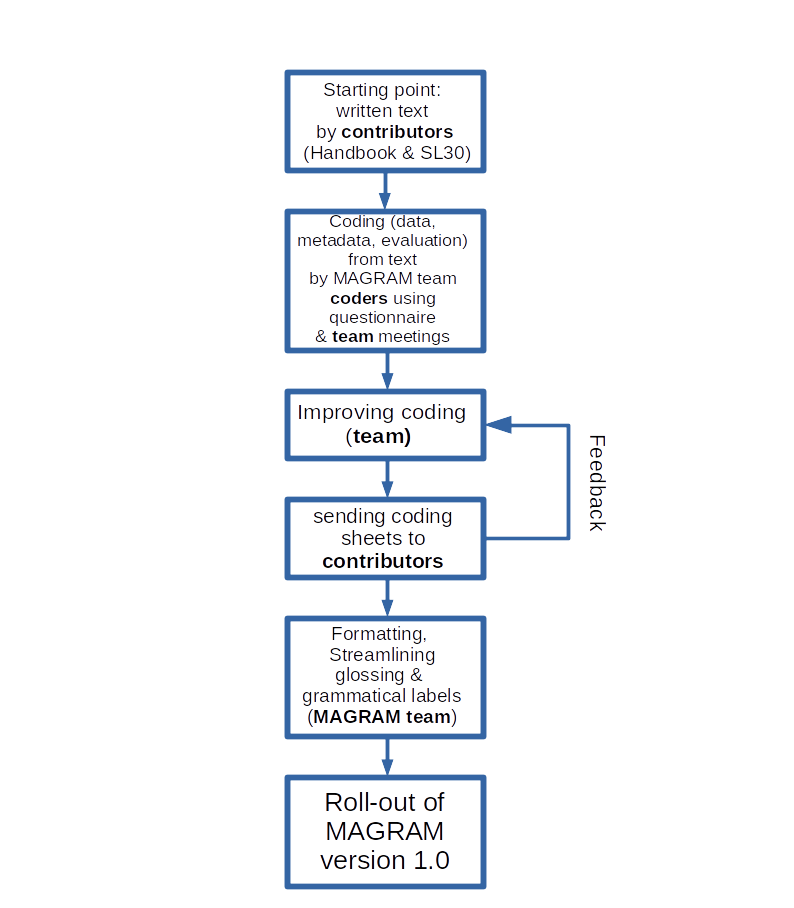

MAGRAM, the MAinz GRAMmaticalization data base
==============================================

<!-- TOC -->
- [1. History and Development of the Project](#1-history-and-development-of-the-project)
- [2. Methodology](#2-methodology)
  - [2.1 Basics](#21-basics)
  - [2.2 Data](#22-data)
  - [2.3 Parameters](#23-parameters)
  - [2.4 Evaluation](#24-evaluation)
- [3. Team & Contributors](#3-team--contributors)
  - [3.1 Core Team](#31-core-team)
  - [3.2 Contributors](#32-contributors)
- [4. Workflow & Design](#4-workflow--design)
  - [4.1 General Design Principles](#41-general-design-principles)
  - [4.2 Form Columns](#42-form-columns)
  - [4.3 Meaning Columns](#43-meaning-columns)
  - [4.4 Simplified Meaning Columns](#44-simplified-meaning-columns)
  - [4.5 Labelgroup Columns] (#45-simplified-meaning-columns)
  - [4.6 Examples](#46-examples)
  - [4.7 Comments](#47-comments)
  - [4.8 Grammaticalization Parameters](#48-grammaticalization-parameters)
- [5. Bibliography](#5-bibliography)
- [6. License, Contact & Citation](#6-license-contact--citation)
- [7. CLDF Datasets](#7-cldf-datasets)
<!-- TOCstop -->

## 1. History and Development of the Project

[MAGRAM](https://en.magram.fb05.uni-mainz.de/) stands for MAinz GRAMmaticalization project. It was funded by the German Research Foundation (DFG; under BI 591/12--1) and conducted at the Johannes Gutenberg Universität Mainz under the leadership of [Prof. Dr. Walter Bisang](https://www.linguistik.fb05.uni-mainz.de/mitarbeiter/walter-bisang/) and [apl. Prof. Dr. Andrej Malchukov](https://www.linguistik.fb05.uni-mainz.de/mitarbeiter/andrej-malchukov/), from January 2016 to March 2020.

MAGRAM began with the hypothesis that grammaticalization is not necessarily cross-linguistically homogeneous (cf. Bisang 2011). The project explored areal and/or cross-phylogenetic variation based on two key hypotheses:

1. Grammaticalization paths of the type \[SOURCE → TARGET\] vary areally/genetically in terms of both the sources and targets associated with specific concepts.
2. There are cross-linguistic differences in the degree of covariation of meaning and form—semantic changes do not always imply form-related changes.

A major outcome of MAGRAM is the two-volume *Comparative Handbook of Grammaticalization Scenarios* ([link](https://www.degruyter.com/serial/grasc-b/html)), which includes:
- A position paper (Bisang et al. 2020a),
- A methodology paper (Bisang et al. 2020b),
- 25 detailed studies on grammaticalization scenarios across languages and areas.

---

## 2. Methodology

### 2.1 Basics

Each grammaticalization path is described by its **source** and **target**, with attention to both **form** and **function/meaning**.

Example:

> (1) *willan* 'want' → *will* FUT (cf. Kuteva et al. 2019: 453)

Intermediate steps are not systematically recorded; instead, we focus on the earliest lexical meaning and the most grammaticalized function and form.

### 2.2 Data

Data sources:
- Chapters from the *Comparative Handbook of Grammaticalization Scenarios*
- A list of 30 source concepts sent to contributors

**Table 1. Source Concepts (Bisang et al. 2020b: 97–101 with reference to Heine & Kuteva 2002)**

| No. | Source Concept         | No. | Source Concept      |
|-----|------------------------|-----|---------------------|
| 1   | arrive                 | 16  | head (body part)    |
| 2   | back (body part)       | 17  | here                |
| 3   | body                   | 18  | leave               |
| 4   | child                  | 19  | live                |
| 5   | come                   | 20  | love                |
| 6   | copula                 | 21  | man                 |
| 7   | demonstrative          | 22  | one                 |
| 8   | do                     | 23  | say                 |
| 9   | fall                   | 24  | see                 |
| 10  | finish                 | 25  | side                |
| 11  | follow                 | 26  | sit                 |
| 12  | get                    | 27  | take                |
| 13  | give                   | 28  | thing               |
| 14  | go                     | 29  | want                |
| 15  | hand (body part)       | 30  | woman               |

_Note: Absence of a source concept in the database for a given language does not necessarily imply its non-existence._

### 2.3 Parameters

We based our grammaticalization parameters on Lehmann’s (1995) framework, adjusted as follows:

**Table 2. Modified Lehmann Parameters**

| Domain          | Paradigmatic                     | Syntagmatic                     |
|-----------------|----------------------------------|---------------------------------|
| **Weight**      | 1. Semantic Integrity (SI)       | —                               |
|                 | 2. Phonetic Reduction (PR)       |                                 |
| **Cohesion**    | 3. Paradigmaticity (PM)          | 4. Bondedness (BD)              |
| **Variability** | 5. Paradigmatic Variability (PV) | 6. Syntagmatic Variability (SV) |

We also added:
- **Decategorization (DC)**
- **Allomorphy (AM)**

### 2.4 Evaluation

Each **target** is assigned a value from 1 to 4 for every parameter. Example for **Bondedness (BD)**:

1. Free morpheme or lexical root
2. Clitic
3. Agglutinative affix
4. Part of a *porte-manteau* or suprasegmental/zero morpheme

Two types of data are collected:
- **Change data**: change (1) / no change (0) from source to target
- **Value data**: value (1–4) per parameter for the target

---

## 3. Team & Contributors

### 3.1 Core Team

- [Walter Bisang](https://www.linguistik.fb05.uni-mainz.de/mitarbeiter/walter-bisang/) (WB) – PI
- [Andrej Malchukov](https://www.linguistik.fb05.uni-mainz.de/mitarbeiter/andrej-malchukov/) (AM) – PI
- [Linlin Sun](https://www.linguistik.fb05.uni-mainz.de/mitarbeiter/linlin-sun/) (LS) – annotation and evaluation
- [Iris Rieder](https://magram.fb05.uni-mainz.de/iris-rieder/) (IR) – annotation and evaluation
- [Eduard Schroeder](https://magram.fb05.uni-mainz.de/eduard-schroeder/) (ES) – annotation and evaluation
- [Marvin Martiny](https://magram.fb05.uni-mainz.de/marvin-martiny/) (MM) – annotation and evaluation, database curation

### 3.2 Contributors

The contributors to our database in alphabetical order of their area of expertise:

- Beja (Cushitic, Afroasiatic): Martine Vanhove
- Chinese (Sinitic, Sino-Tibetan): Linlin Sun and Walter Bisang
- Creoles and Pidgins: Susanne Michaelis and Martin Haspelmath
- Emai (Edoid, Niger-Congo): Ronald P. Schaefer and Francis O. Egbokhare
- German (Indo-European): Luise Kempf and Damaris Nübling
- Hoocak (Core Siouan): Johannes Helmbrecht
- Indo-Aryan (Indo-European): Annie Montaut
- Iranian (Indo-European): Agnes Korn
- Iroquoian: Marianne Mithun
- Japhug (Rgyalrong, Sino-Tibetan): Guillaume Jacques
- Khmer (Austroasiatic): Walter Bisang
- Korean: Seongha Rhee
- Lezgic (Northeast Caucasian): Timur Maisak
- Malayo-Polynesian (Austronesian) & Mori (Yareban): Nikolaus P. Himmelmann
- Manding (Mande, Niger-Congo): Denis Creissels
- Mian (Papua New Guinea): Sebastian Fedden
- Nyulnyulan (Non-Pamanyungan, Australian): William B. McGregor
- Quechua and Aymara: Willem F. H. Adelaar
- Romance (Indo-European): Michela Cennamo
- Slavic (Indo-European): Björn Wiemer
- Southern Uto-Aztecan: Zarina Estrada-Fernández
- Thai: Walter Bisang
- Tswana (Bantu, Niger-Congo): Denis Creissels
- Tungusic (Manchu-Tungusic, Transeurasian): Andrej Malchukov
- Uralic: Juha Janhunen
- Yeniseian: Edward Vajda
- Yucatecan (Mayan): Christian Lehmann

---

## 4. Workflow & Design

This is a schematic overview of the steps leading to the creation of the database:

**Figure 1.** Schematic overview of the project workflow.

---

### 4.1 General Design Principles

There are three main data types:
- **Metadata** (path-specific and language-specific)
- **Path descriptions** (including examples and comments)
- **Parameter evaluations**

### 4.2 Form Columns

1. Language material only
2. One form (citation form)
3. Allomorphs: separated by commas; zero alternation in round brackets
4. Coding: periphery in brackets (with `+` for unbound items)
5. Non-Latin script: in `<angle brackets>`
6. Syntactically (not phonologically) bound morphs: use `<.>` instead of space

### 4.3 Meaning Columns

1. Function only
2. One function per entry
3. Correspondence to form columns
4. Primordial source prioritized
5. Formatting:
   - (core) grammatical: CAPS
   - (core) lexical: *'quotes'*
   - Other: lowercase
6. Coding periphery follows the same principles as form
7. Variation in terminology

### 4.4 Simplified Meaning Columns

- Grammatical labels: We use a fixed set of grammatical labels defined in a separate document ('grammatical labels').
- Polygrammaticalization: When multiple targets stem from the same source, we display the most grammaticalized meaning; others may appear in the comments.

### 4.5 Labelgroup Columns

For the web version of the database, we have added groupings of grams for easier access. Those groupings are based on broad interpretations of the items' functions. And although they have some theoretical background, they are not to be seen as proper comparative concepts. They are there for your convenience and have been assigned in a short amount of time, without the necessary attention to detail necessary for strict grouping.

### 4.6 Examples

- **Glossing** follows the Leipzig Glossing Rules
- If no citation is given for an example, the contributor is the source (p.c.)

### 4.7 Comments

Multiple comments are separated by semicolons.

### 4.8 Grammaticalization Parameters

Each of the 8 parameters is defined in detail in the methodology paper (Bisang et al. 2020b). Additional notes:

- Decategorization & Syntagmatic Variability: These use the lexical item’s original category (e.g., noun, verb) and positional freedom as baselines.
- Semantic Integrity: The distinction between ‘referential’ (2) and ‘relational’ (3) should be understood in the sense that lexical categories have denotations (they independently convey the concept of a property, action or object), while grammatical categories do not.
- Inflectional semantic case will be treated as value 4 for the parameter of Semantic Integrity, because practically every semantic case also constitutes a minor pattern of syntactic case.
- Phonetic reduction: the nucleus approach singles out one morph of the source construction as the nucleus, which is measured. It is compared to the corresponding part of the target construction. If elements fuse in the course of the development (univerbation), unintuitive values for phonetic reduction may occur. This method has the advantage of theoretical consistency insofar as it applies the same metrics to the same unit of analysis (the nucleus).

---

## 5. Bibliography

- Bisang, Walter. 2011. *Grammaticalization and typology*. Oxford University Press.
- Bisang et al. 2020a. *Grammaticalization Scenarios*, Vol. 1 & 2.
- Bisang et al. 2020b. *Measuring grammaticalization: A questionnaire*.
- Hammarström et al. 2022. [Glottolog](https://glottolog.org/)
- Kuteva et al. 2019. *World Lexicon of Grammaticalization* (2nd ed.).
- Lehmann, Christian. 1995 \[1982\]. *Thoughts on grammaticalization*. Lincom Europa.

---

## 6. License, Contact & Citation

### License
CC-BY-SA

### Contact
📧 [wbisang@uni-mainz.de](mailto:wbisang@uni-mainz.de)

### How to Cite MAGRAM

**Dataset citation** (e.g., Yucatec Maya):
> Christian Lehmann & MAGRAM team. 2025. *Yucatec Maya*. In: Bisang, Walter & Malchukov, Andrej & Martiny, Marvin (eds.) *Mainz Grammaticalization Project*. Leipzig: Max Planck Institute for Evolutionary Anthropology. [https://crossgram.clld.org/contributions/magram](https://crossgram.clld.org/contributions/magram)

**Full database citation**:
> Bisang, Walter, Malchukov, Andrej & Martiny, Marvin (eds.). 2025. *MAGRAM: Mainz Grammaticalization Project Database*. Leipzig: Max Planck Institute for Evolutionary Anthropology. [https://crossgram.clld.org/contributions/magram](https://crossgram.clld.org/contributions/magram)

## 7. CLDF Datasets

The following CLDF datasets are available in [cldf](cldf):

- CLDF [Wordlist](https://github.com/cldf/cldf/tree/master/modules/Wordlist) at [cldf/Wordlist-metadata.json](cldf/Wordlist-metadata.json)
- CLDF [StructureDataset](https://github.com/cldf/cldf/tree/master/modules/StructureDataset) at [cldf/CrossGram-metadata.json](cldf/CrossGram-metadata.json)
